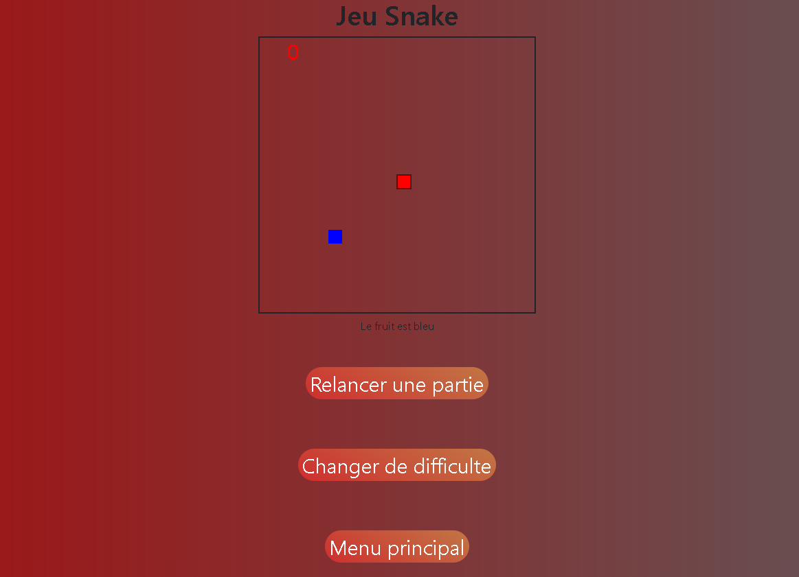

# Site de Mini-jeux

Ce projet est un site web local de mini-jeux interactifs, incluant des jeux comme le Morpion et le Snake. Il comprend également un classement où vous pouvez voir les meilleurs joueurs par jeu.\
**Je n'ai pas été seul sur ce projet, nous avons réalisé ce projet à deux.**

## Sommaire
- [Aperçu](#aperçu)
- [Fonctionnalités](#fonctionnalités)
- [Utilisation](#utilisation)
- [Configuration de la Base de Données](#configuration-de-la-base-de-données)
- [Technologies Utilisées](#technologies-utilisées)
- [Licence](#licence)

## Aperçu
La base de données :
\

Le site :
\





## Fonctionnalités

- **Jeu du Morpion** : Un jeu classique de Tic-Tac-Toe permettant à deux joueurs de s'affronter.
- **Jeu du Snake** : Un jeu où l'utilisateur contrôle un serpent qui grandit en mangeant des objets. Plusieurs niveaux de difficulté sont disponibles, avec un classement par niveau.
- **Jeu du Puissance 4** : En cours de développement.
- **Page de Classement** : Une page où vous pouvez consulter les classements des différents jeux disponibles.
- **Compte utilisateur** : Le site permet de créer un compte ou de se connecter pour enregistrer les scores des parties.

## Utilisation

Pour exécuter le projet, lancez le fichier `views.py` dans un environnement Python.\
Ensuite, ouvrez votre navigateur et accédez à l'URL suivante : [http://localhost:5000/](http://localhost:5000/).\
Assurez-vous que la base de données MySQL est correctement configurée comme indiqué ci-dessous.

**Attention** : La base de données n'est pas sécurisée (le mot de passe est visible), donc il est inutile d'utiliser un mot de passe complexe.

## Configuration de la Base de Données

Le projet utilise une base de données MySQL locale. Voici les étapes de configuration :

### Installation de MySQL

1. Téléchargez MySQL : [MySQL Community Downloads](https://dev.mysql.com/downloads/installer/)
2. Suivez les instructions d’installation pour votre système d’exploitation.
3. Choisissez la version "Serveur only".
4. Laissez toutes les configurations par défaut.
5. Il vous sera demandé de définir un mot de passe pour l'utilisateur `root` de MySQL. Gardez ce mot de passe, vous en aurez besoin pour vous connecter à MySQL depuis Python.

### Démarrer MySQL

1. Ouvrez `MySQL Command Line Client` depuis votre barre de recherche et entrez votre mot de passe. 

### Installation du connecteur MySQL pour Python

Le projet utilise le connecteur MySQL pour Python afin de communiquer avec la base de données MySQL. Suivez les étapes ci-dessous pour installer le connecteur :

1. Ouvrez un cmd ou terminal de commande (invité de commande).
2. Exécutez cette commande : 
```bash 
pip install mysql-connector-python
```

### Création de la Base de Données et des Tables

Une fois MySQL installé et le connecteur Python prêt, vous pouvez créer la base de données et la table pour stocker les données des badges RFID.

1. Ouvrez `MySQL Command Line Client` depuis votre barre de recherche et entrez votre mot de passe. 

2. Une fois connecté à MySQL, vous pouvez créer la base de données. Exécutez la commande suivante pour créer une base de données nommée `mini_jeux` :
```bash
CREATE DATABASE mini_jeux;
```

3. Sélectionnez la Base de Données pour pouvoir y ajouter la table de donnée :
```bash
USE mini_jeux;
```

4. Créer la Table `mini_jeux` qui contient les informations des badges RFID :
```bash
CREATE TABLE mini_jeux(id int(4) NOT NULL AUTO_INCREMENT, pseudo TEXT, mdp TEXT, snake_1 int(4), snake_2 int(4), snake_3 int(4), nb_joue_snake int(4), nb_victoire_morpion int(4), nb_joue_morpion int(4), nb_victoire_puissance_4 int(4), nb_joue_puissance_4 int(4), PRIMARY KEY(id) );
```

5. Création des données : Exécutez la commande SQL suivante pour insérer des données dans la table :
```bash
INSERT INTO mini_jeux(pseudo,mdp,snake_1,snake_2,snake_3,nb_joue_snake,nb_victoire_morpion,nb_joue_morpion, nb_victoire_puissance_4, nb_joue_puissance_4) VALUES ("test","test","0","0","0","0","0","0","0","0");
```


6. Vérification de vos données (facultatif) : Exécutez la commande SQL suivante pour vérifier que vos données sont bien enregistrées.
```bash
SELECT * FROM mini_jeux;
```

### Configuration de la Connexion MySQL dans le Code Python

Maintenant que la base de données est créée, vous devez configurer la connexion MySQL dans votre code Python. Voici le code pour établir la connexion depuis le fichier Python `views.py` (ligne 10 à 16) :
```python
import mysql.connector

conn = mysql.connector.connect(
    host="localhost",            # Hôte de la base de données 
    user="root",                 # Nom d'utilisateur MySQL
    password="",                 # Mot de passe MySQL (ajoutez ici votre mot de passe défini)
    database="badge"             # Nom de la base de données à utiliser
)
```

## Technologies Utilisées

- **Back-end** : Python avec Flask pour gérer la logique du jeu et les interactions avec la base de données MySQL.
- **Base de données** : MySQL pour stocker les informations des joueurs et leurs scores.
- **Front-end** : HTML, CSS, JavaScript pour l'interface utilisateur et l'interactivité des jeux.


## Licence

Réalisation dans le cadre d'un projet scolaire de janvier 2024 à mars 2024.
